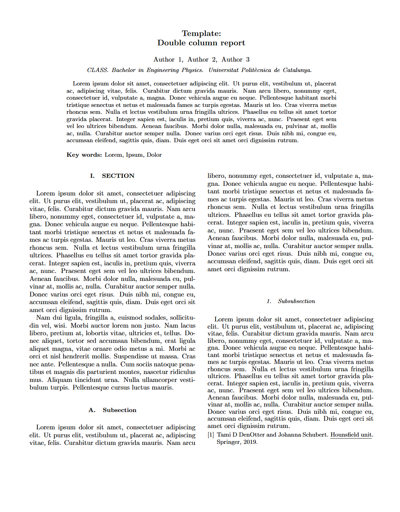
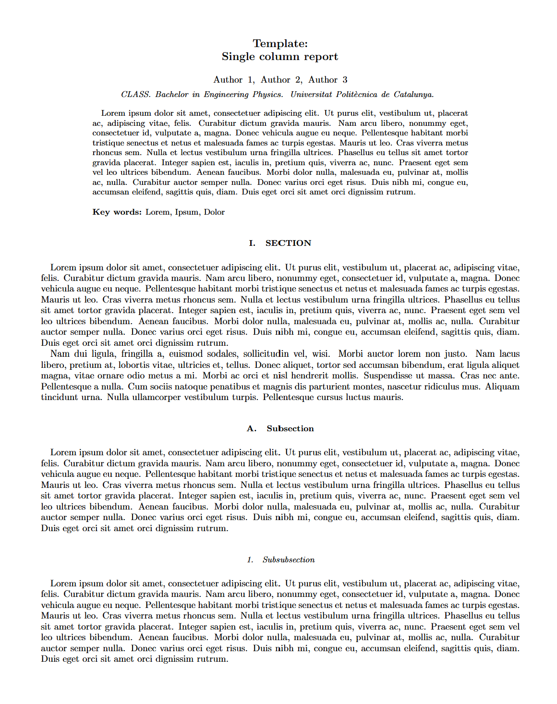
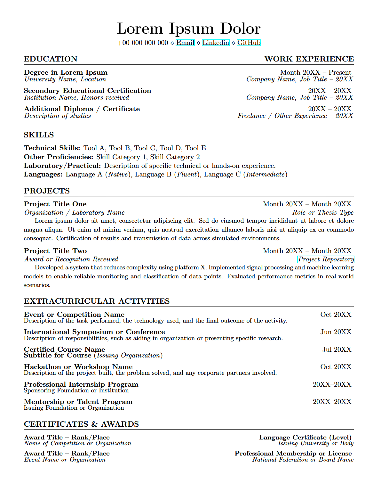
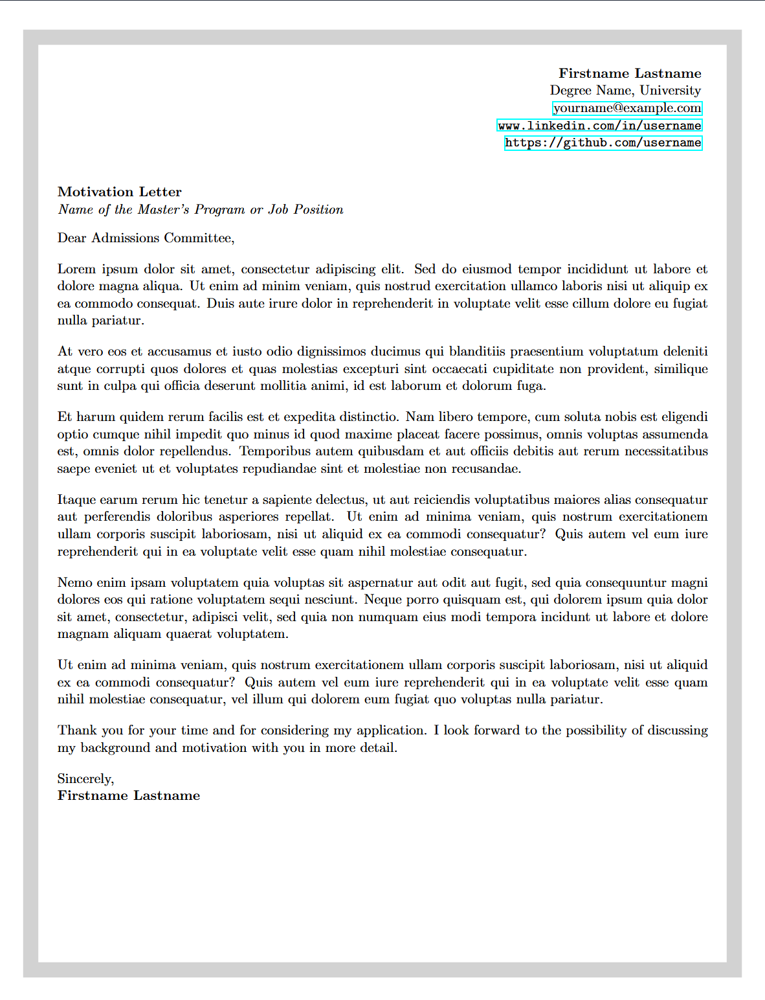

# LaTeX Templates Collection

A collection of curated LaTeX templates. We'll keep adding more; if you have any suggestions, please send an email to: EMAIL.  
This repository was brought to you by:

## How to use
Ideally, you will need to have *git* installed. If you don't have it, we advise you to look into it, as it will be useful in your career. If you are too stubborn and/or scared of the terminal, simply copy and paste each code to your computer...this is a judgement-free space.

1. Clone the repository: `git clone https://github.com/consigliere0/LaTeX-Templates.git`.
2. Navigate to the desired folder.
3. Open template files in your preferred editor (Overleaf, VS Code, TeXworks, Vim,...). Some templates are a single .tex file; for others the whole folder must be downloaded, as the packages and contents files are imported into a `main.tex` file.

> ***Pro tip 1**: get used to using an offline editor. The (free) Overleaf compilation time keeps getting shorter, and it might not be enough for some lab reports, assignments, or your thesis...*

> ***Pro tip 2**: for Overleaf group projects, you might want to create a joint email account and share it across team members. This way more than two people can edit the same document ;)*

In most templates there is an example image and code, so you know how to properly format it according to the template's specifications. There is also BibTeX integration with some example references, simply substitute your references in the *.bib* file.

>***Pro tip 3**: you can find the citation form for BibTeX by searching the article in Google Scholar --> Cite --> BibTeX, and copy&paste the code.*

## What's inside

### APS Scientific Report (double column)
Based on the official **revtex4-2** class used by the American Physical Society (which can be found in Overleaf templates). Includes BibTeX integration.

  

### APS Scientific Report (single column)
Same template as the double-column version, but tweaked so it only has one.

  

### Curriculum Vitae
More formats will be added to this folder in due course.

  

There is also a motivation letter:

  

### Formula sheet
